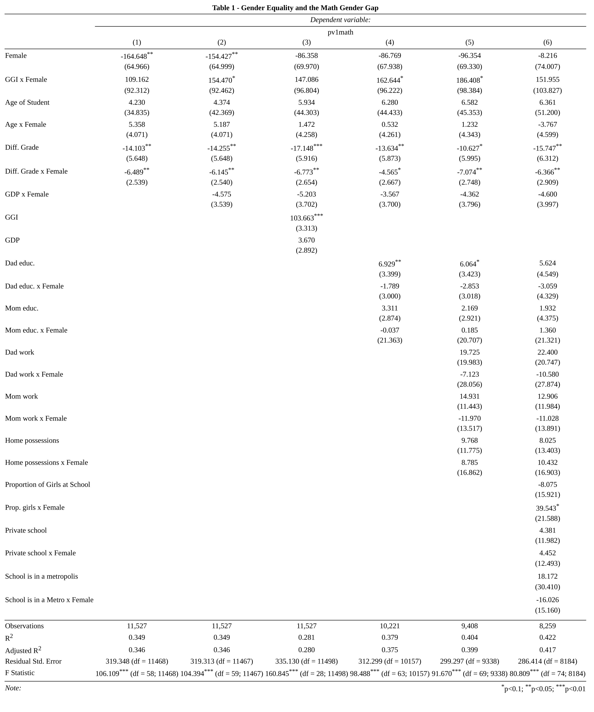

# Advanced Econometrics 
[Homework Python](https://github.com/eng-jonathan/QC_ECON_387_AdvancedEconometrics/tree/master/homework_python) |
[Homework R](https://github.com/eng-jonathan/QC_ECON_387_AdvancedEconometrics/tree/master/homework_r) |
[Midterm](https://github.com/eng-jonathan/QC_ECON_387_AdvancedEconometrics/tree/master/midterm) |
[Syllabus](https://github.com/eng-jonathan/QC_ECON_387_AdvancedEconometrics/blob/master/syllabus/syllabus_econ387.pdf) 
___
### [Midterm](https://github.com/eng-jonathan/QC_ECON_387_AdvancedEconometrics/tree/master/midterm)
* [Assignment](https://github.com/eng-jonathan/QC_ECON_387_AdvancedEconometrics/blob/master/midterm/midterm_prompt.pdf) 
* [Submission](https://github.com/eng-jonathan/QC_ECON_387_AdvancedEconometrics/blob/master/midterm/midterm.Rmd)
* Replicate the main results of Nollenberger, Rodr´ıguez-Planas and Sevilla (2016) [*The Math Gender Gap*](https://github.com/eng-jonathan/QC_ECON_387_AdvancedEconometrics/blob/master/midterm/the_math_gender_gap.pdf) using statistical modeling in ***R***
* Highlight(s)

___
### Course Objectives:
* Introduce students to the computational aspects of econometric analysis using Python and R
* Continue building on the regression analysis of the first semester, and introduce a number of important extensions

### Course Topics:
* Static panel data models
* Instrumental variable methods
* Basic analysis of time series data
* Data types, objects in Python and R
* Control structures and custom functions in Python and R
* Data frames and graphics in Python and R
* Classical linear regression analysis using Python and R
* Static panel data models such as one-way and two-way error models
* Endogenous regressor problem, instrumental variable approach
* Time series models, forecasting and evaluation of forecasting performance
___
